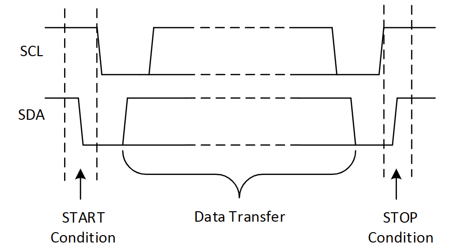
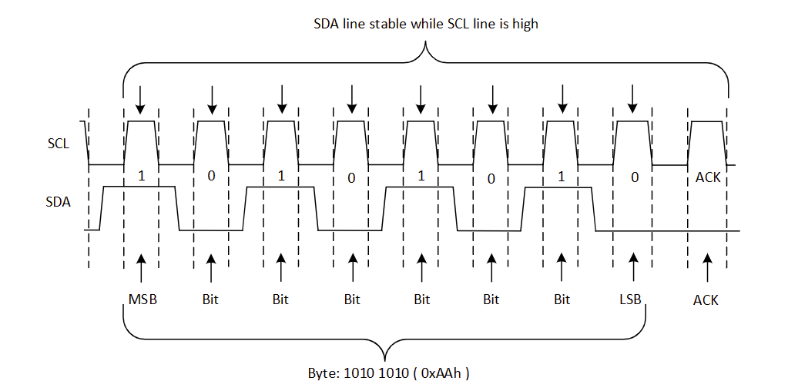
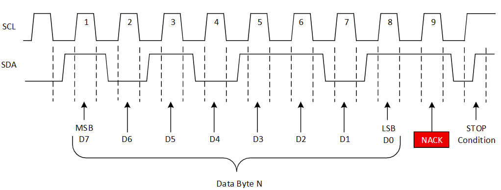
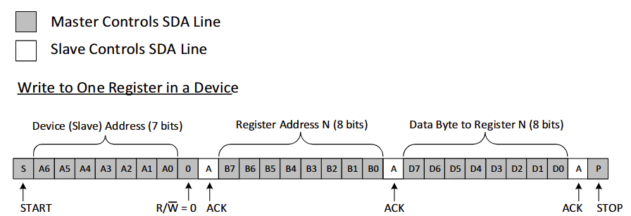
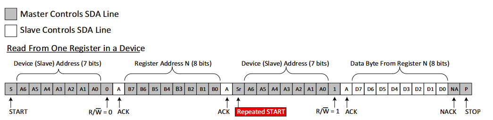

# I2C协议使用

本部分首先介绍I2C协议通信过程，然后介绍使用ssd1306 OLED屏幕的官方案例。

## I2C协议介绍

I2C通信的一般过程：

1. 如果主机想要向从机发送数据：
   * 主机发送器向从机接收器发送**起始**条件和地址。
   * 主机发送器向从机接收器发送数据。
   * 主机发送器向从机接收器发送**终止**条件来结束传输。
2. 如果主机想要从从机接收/读取数据：
   * 主机接收器向从机发送器发送**起始**条件和地址。
   * 主机接收器向从机发送器发送需要读取的寄存器。
   * 主机接收器从从机发送器接收数据。
   * 主机接收器向从机发送器发送**终止**条件来结束传输。

### 起始和终止条件

I2C通信从起始条件（START condition）开始，到终止条件（STOP condition）结束。如上图所示，起始条件即为在SCL（时钟信号）为高电平时SDA的下降沿，终止条件即为在SCL为高电平时SDA的上升沿。

### 重复起始条件

重复的起始条件用于一个紧密相连的“终止-起始”条件。看起来和一个起始条件相同，但它在上一个起始条件还没有终止时出现（即，在总线仍然非空闲时）。在主机希望开始一个新的通信过程而不希望发送终止条件让出总线所有权（在多主机系统中，发送终止条件可能让主机失去对总线的控制，让渡给另一个主机）时使用。

### 数据有效性和字节格式

一个SCL的脉冲传输一个比特。一个字节为SDA上传输的8个比特。一个字节要么是设备地址、寄存器地址或者读写的数据。数据以大端（Most Significant Bit，MSB）先传的顺序传输。从起始条件到终止条件，允许传输任意数量的数据字节。SDA上的电平在SCL高电平时不可改变，因为SCL高电平时的下降和上升沿被视为起始和终止条件。

### 确认（ACK）和未确认（NACK）

每个字节的数据（包括地址）都需要跟随一个来自接收方的ACK比特。ACK比特允许接收方和发送方沟通：该字节已成功接收，请发送下一个字节。

在接收方发送ACK之前，发送方必须释放自己的SDA线。要发送ACK比特，接收方需要在发送ACK的时钟周期的低电平时拉低SDA线，然后在这个时钟周期的高电平时保持SDA的低电平。必须考虑设置和保持时间。

若SDA线在ACK时钟的高电平时期为高电平，则为NACK，有以下几个导致NACK的条件：

1. 接收方无法接受数据或传送，因为它正在执行一些实时操作，没有准备好和主机通信。
2. 传送时出现了接收方无法理解的数据。
3. 传送时接收方不能接收到数据字节。
4. 主机接收机已经完成读取数据，用NACK向发送从机表明这一点。

### 读写数据

#### 写字节

主机发送起始条件和设备地址，且设备地址最后一位R/W'设为0，表示写操作。从机返回ACK后，主机发送要写的寄存器地址。从机再次返回ACK，表示已准备好。之后，主机开始向从机发送数据，直到数据发送完之后，主机使用终止条件结束发送。

#### 读字节

读字节开始时和写字节类似，都是发送设备地址（且设备地址最后一位R/W'设为0）然后发送寄存器地址。但这之后，**主机需要再次发送一个起始条件以及设备地址**，这时设备地址最后一位R/W'设为1表示读数据。然后从机返回ACK以及寄存器中的数据，这个过程中主机需要释放SDA总线成为接收机，从机为发送机。

主机仍然发送时钟脉冲以传输数据。每个字节结束后主机发送ACK表示需要更多数据，发送NACK表示停止发送并让从机释放SDA总线。然后主机发送终止条件。

