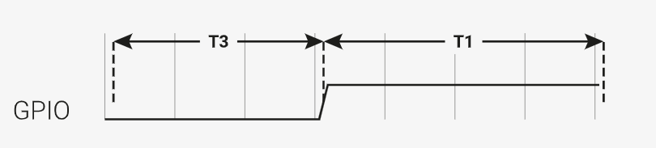
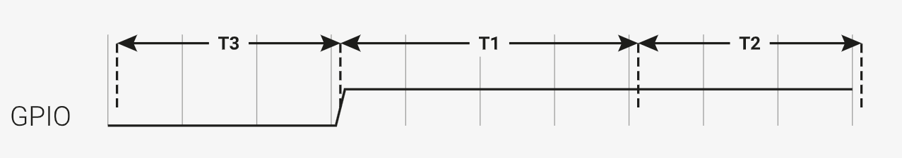
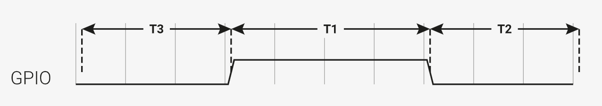
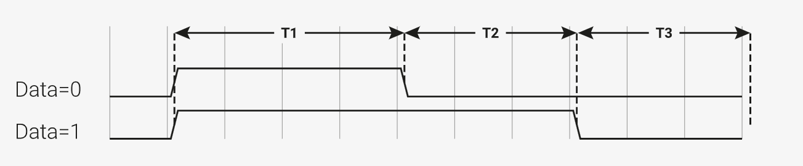
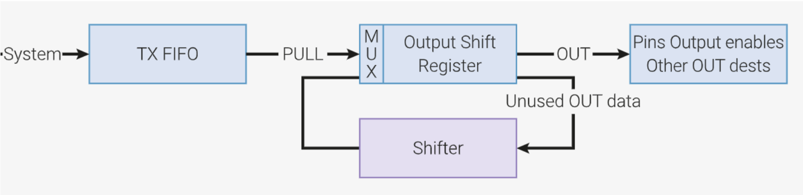
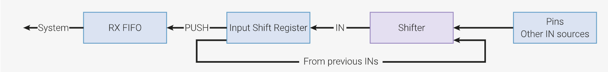

# PIO使用

本教程致力于完整且深入浅出地解释如何使用PIO，以及PIO的功能特点。阅读本教程，最好对以下科目有所了解：

* 计算机组织与架构
* 数字系统FPGA设计
* 微机系统与接口

不需要多么深入，但是应该有大致的了解。最好写过汇编语言程序。同时，对Linux系统编程中的一些概念，例如缓冲区、阻塞，需要具备基本的认识。

本教程主要是对`raspberry-pi-pico-c-sdk.pdf`以及`rp2040-datasheet.pdf`这两个文档中部分内容的翻译以及整理，并按照我认为便于理解的顺序排版。

为了区分pio程序和其他程序，这里把前者称作“PIO程序”，后者称作“系统程序”或者“系统”。

PIO用于自定义硬件接口、通信协议等。比如说，在原有基础上新增几个UART接口，或者输出DPI视频，或者和没有现成驱动的设备通信等。PIO的工作过程主要包括：

* 把程序加载进PIO的指令内存
* 设置PIO状态机来运行程序
* 状态机运行后与之交互

PIO状态机是PIO程序的运行者，它从指令内存读取PIO程序指令并运行。完成PIO程序执行过程主要需要：

* 一个PIO程序
* 相应C程序来调用它
* cmake文件，用于联合以上二者

## 入门：官方案例解释

以下是对pico_examples中关于pio的两个案例的中文解释，对原有注释进行了一定的改写，但是大体上没有改变原意，用于熟悉PIO编程。

### 第一个案例：hello_pio

首先是PIO程序`hello.pio`：

```
.program hello

; Repeatedly get one word of data from the TX FIFO, stalling when the FIFO is
; empty. Write the least significant bit to the OUT pin group.

loop:
    pull
    out pins, 1
    jmp loop
```

该程序重复地从TX FIFO中获取一个字（word，这里是32bit）的数据，到FIFO为空时停止，把最小位数据（即把数据写作二进制形式，从左往右数的最后一位）写入到输出引脚。

`pull`指令把数据从FIFO取出，然后放入输出移位寄存器（output shift register，OSR）中。一次取一个字。`out`指令能够把OSR中的数据移出到其他目的地，一次一个或多个位。

> FIFO是实现在硬件中的先进先出的数据队列。每个状态机有两个FIFO，处于状态机和系统总线之间，用于从芯片上移入和移出数据。

这里`out`指令从刚刚取出的数据中取最低的1位并写入引脚。

`jmp`指令跳转到`loop:`，这里是一个死循环。整个程序的功能是重复从FIFO取出一个字，从这个字取出最低位，并写入引脚。

`.pio`文件还包含一个帮助函数，用于设置状态机来正确运行此程序：

```c
static inline void hello_program_init(PIO pio, uint sm, uint offset, uint pin) {
    pio_sm_config c = hello_program_get_default_config(offset);

    // 把状态机的输出引脚映射到一个具体的引脚上，即此函数的参数`pin`
    sm_config_set_out_pins(&c, pin, 1);
    // 设置此GPIO引脚的功能为PIO，同时连接该引脚与PIO实例
    pio_gpio_init(pio, pin);
    // 设置引脚方向为输出
    pio_sm_set_consecutive_pindirs(pio, sm, pin, 1, true);

    // 加载状态机配置，同时跳转到程序开始处
    pio_sm_init(pio, sm, offset, &c);
    // 状态机开始运行
    pio_sm_set_enabled(pio, sm, true);
}
```

主要做的事情就是设置我们需要用来输出数据的GPIO引脚。在这里有三件事需要考虑：

1. 状态机需要知道哪个（些）GPIO引脚用于输出。实际上有**四个不同的引脚组**需要设置，分别对应不同情况，这里我们只设置了**输出引脚组**`sm_config_set_out_pins(&c, pin, 1)`，因为我们只用到了`out`指令。
2. GPIO同样需要被告知它现在用于PIO，正被PIO控制：`pio_gpio_init(pio, pin)`。
3. 如果我们只使用这个引脚作输出，需要确保PIO驱动输出使能线为高电平。PIO可以用譬如`out pindirs`这样的指令控制输出使能线为高电平还是低电平。在这里，我们在PIO程序开始之前就设置好了：`pio_sm_set_consecutive_pindirs(pio, sm, pin, 1, true)`。

然后是C程序，用于配置并调用PIO程序。需要注意，`hello.pio`在编译时自动生成一个`hello.pio.h`，称为汇编器的输出文件，用于在C程序中调用。C程序具体如下：

```c
/**
 * Copyright (c) 2020 Raspberry Pi (Trading) Ltd.
 *
 * SPDX-License-Identifier: BSD-3-Clause
 */

#include "pico/stdlib.h"
#include "hardware/pio.h"
// 由PIO程序文件编译出的头文件：
#include "hello.pio.h"

int main() {
#ifndef PICO_DEFAULT_LED_PIN
#warning pio/hello_pio example requires a board with a regular LED
#else
    // 选择PIO实例(总共有2个，这里用pio0)
    PIO pio = pio0;

    // 加载汇编后的程序到PIO的指令内存。这个函数自动在指令内存中找到一个有足够内存空间的位置（即偏移量），这里需要保存该偏移量
    uint offset = pio_add_program(pio, &hello_program);

    // 找到一个我们要用的PIO上面的空闲的状态机。没有就会报错。
    uint sm = pio_claim_unused_sm(pio, true);
    // 使用.pio文件中的帮助函数配置并运行状态机。这里传入pio实例，状态机，要运行的指令在指令内存里面的位置，以及作为输出的引脚（这里是板载LED引脚）。
    hello_program_init(pio, sm, offset, PICO_DEFAULT_LED_PIN);

	// 状态机开始运行。所有我们放进TX FIFO的值都会体现在LED引脚上。
    while (true) {
        // 亮
        pio_sm_put_blocking(pio, sm, 1);
        sleep_ms(500);
        // 暗
        pio_sm_put_blocking(pio, sm, 0);
        sleep_ms(500);
    }
#endif
}
```

**RP2040有2个PIO块，每个PIO有四个状态机。** 每个PIO都有一块能够容纳32条指令的指令内存，且能够被四个状态机共享。我们首先在状态机运行之前把我们的程序加载进指令内存，使用`pio_add_program(pio, &hello_program)`。

> 32条指令听起来很少，但PIO程序密度实际上很高，一个完美的UART程序4条指令就可以实现，可以去看`pico_examples`里面的`pio/uart_tx`。

程序加载以后，我们找一个空闲状态机并让它运行我们的程序。四个状态机可以运行相同的程序，也可以运行不同的程序——前提是指令内存够用。

最后，我们把状态机输出到板载LED。

此时，状态机开始自动运行，但是处于暂停状态：TX FIFO还没有数据。`pio_sm_put_blocking(pio, sm, 1)`可以向TX FIFO直接填充数据。如果TX FIFO已满，这个函数会阻塞。填1点亮LED，填0熄灭。

这里有一个疑问：PIO程序每次循环都从FIFO读一个数据，但是我们每隔500ms才写入一次数据，明显慢于读取，理论上有很长一段时间FIFO处于空的状态，PIO读的是什么？答案是，`pull`指令在FIFO没有数据时阻塞，状态机暂停，引脚电平也会保持之前的状态。

最后是cmake文件，但是一般可以用pico-project-generator来自动产生CMakeLists.txt，这里就不再解释。

### 第二个案例：WS2812 LED

WS2812 LED是一个可寻址的RGB LED。换句话说，它发光的红、绿、蓝三种颜色可以单独设置，并且串联起来只需要留一个单独的输入端而仍然能够控制所有的LED灯珠。每个LED都有一对电源引脚，一个串口输入引脚以及一个串口输出引脚。

当串口数据输入到LED的输入引脚，LED只据前三个字节（分别代表红、绿、蓝）为己用，剩余的会向后传递，输出到它的串口输出引脚。一般这种LED会串联成一个长链，但是电源端并联，而前一个LED的输出作为后一个的输入。一长串的数据从第一个LED输入，在每一个LED处都减少三个字节作为该LED的RGB数据，所以说它们的颜色可以单独控制。

不幸的是这种LED用不同宽度的正脉冲代表0或1，即两种脉冲高电平持续时长不同（如下图），需要精确的时间控制。为达到时间精度要求，可以按比特传输这种协议，也可以封装好比特序列再用常规串口通信协议（像SPI、I2S）传输，但这样软件成本和复杂度比较高。


理想情况下我们希望能把所有CPU周期都用在产生颜色序列上，或者处理与这些LED相关的其他任务上。PIO能够做到这一点。

我们仍然首先看PIO程序。

```
.program ws2812
.side_set 1

.define public T1 2
.define public T2 5
.define public T3 3

.lang_opt python sideset_init = pico.PIO.OUT_HIGH
.lang_opt python out_init     = pico.PIO.OUT_HIGH
.lang_opt python out_shiftdir = 1

.wrap_target
bitloop:
    out x, 1       side 0 [T3 - 1] ; 即使前面的指令暂停执行，side-set也会生效
    jmp !x do_zero side 1 [T1 - 1] ; 根据我们刚刚移出的一位数据跳转。同时产生正脉冲
do_one:
    jmp  bitloop   side 1 [T2 - 1] ; 持续高电平，即长脉冲
do_zero:
    nop            side 0 [T2 - 1] ; 转低电平, 短脉冲
.wrap
```

现在逐行解释上面的代码。第一行告诉汇编器我们定义了一个名为ws2812的程序：

```
.program ws2812
```

一个`.pio`文件里面可以有多个程序，每个程序都要有自己的`.program`语句。汇编器依次处理每一个程序，所有汇编后的程序都会出现在输出文件里。

每个PIO指令都是16位长，每条指令中都有5个二进制位用作“延迟”（因为是5位，所以可以延迟0~31个时钟周期），**“延迟”发生在该指令执行后、下一条指令执行之前。**当然，这5位也可以用作另一个用途，那就是side-set：

```
.side_set 1
```

语句`.side_set 1`表示我们占用了5个延迟位中的一个用作“side-set”。在执行指令本身功能之外，状态机还根据这个被占用的位控制**side-set引脚组**（前面提到过的四个引脚组之一）中引脚的电平，一条指令作用一次。这不仅在高速操作下十分有用，而且可以缩短程序大小，节约指令内存。

注意，占用一个延迟位让延迟时间只能用4个位表示，延迟时长范围缩小到0~15个时钟周期。这很正常，side-set往往用于高速操作场景，这种情况下不会需要太长的延迟。`.side_set 1 opt`表示side-set是可选的，并且需要消耗另一个数据位表示当前指令是否有side-set。这里没有用`opt`，因此每条指令都必须side-set，也就是每条指令后面跟随的`side N`。

```
.define public T1 2
.define public T2 5
.define public T3 3
```

`.define`用于声明常量，关键字`public`表示汇编器会把该常量定义转换到输出文件中，让其他语言软件也可以使用。例如在C语言SDK这样使用时，汇编器会生成`#define`宏定义。这里我们用T1、T2、T3来计算每条指令延迟的时钟周期数。

```
.lang_opt python
```

给MicroPython PIO库看的。用C语言SDK时就不用管它。

```
.wrap_target
```

先不看上面这行，后面会提到——它和`.wrap`是一对儿。

```
bitloop:
```

上面是一个标签（Label），作用和汇编语言中的标签一样（如果你学过8086汇编的话，我可以告诉你这和8086汇编的标签是一个东西）。它对程序中的这个位置做了个标记，你可能在其他地方用到这个标记以指代这个位置。和汇编一样，主要也是由`jmp`指令使用。

```
    out x, 1       side 0 [T3 - 1]
```

终于来了第一条PIO指令，有许多信息可以解读：

* 这是一个`out`指令，它从OSR取出一些二进制位，并写入其他地方。此处OSR中应含有LED的颜色信息，并且取出一位写入`x`寄存器。
* `x`是两个暂存寄存器之一，另一个叫`Y`。这里`x`是`out`指令的目标操作数，是写数据的地方。状态机使用暂存寄存器存储和比较临时值，在PIO编程模型的寄存器部分会详细介绍。
* `[T3 - 1]`是需要延迟的时钟周期数。`T3`是我们之前定义的常量。因为指令本身占用一个周期，带上延迟，正好就是`T3`个周期。
* `side 0`驱动side-set引脚为低电平。
* `;`后面的都是注释，汇编器忽略它们。

> OSR是从TX FIFO取出数据过渡地带，数据一个字一个字地从TX FIFO移入OSR，一个字是32位。`out`指令通过移位操作把数据分成小片，并把移出的数据发送到几个不同的目的地（例如引脚）。
> 移出的位数由`out`指令记录，方向要提前设置好，详情请看后面的PIO编程模型的相关部分。

所有状态机在执行上面这条指令时会进行以下操作：

1. 把side-set引脚设置为低电平（0），即使OSR没有数据导致指令暂停也是如此。
2. 从OSR移出一位放进X寄存器。X的值要么是0要么是1。
3. 指令执行后等待`T3 - 1`个时钟周期，整体用时`T3`个时钟周期。**注意状态机运行指令所用的时钟周期是系统时钟分频后的结果，并不一定是系统时钟。**

下一条指令是：

```
    jmp !x do_zero side 1 [T1 - 1]
```

1. `side 1`在side-set引脚输出高电平，这是我们脉冲的起始上升沿
2. 如果`x == 0`那么跳转到`do_zero`，否则继续执行下去。
3. 本指令执行后延迟`T1 - 1`个时钟周期。

目前为止程序输出波形是：



引脚维持了T3时间的低电平，然后T1个周期的高电平。如果`X`值为1，接下来将按顺序执行`do_one:`位置的指令：

```
do_one:
    jmp  bitloop   side 1 [T2 - 1]
```

这条指令做了这些事情：

1. `side 1`继续在side-set引脚输出高电平。
2. `jmp`指令无条件跳转到`bitloop`，状态机结束对这一位数据的传输，开始传输下一位。
3. 本指令结束后延迟`T2 - 1`个周期。

现在输出波形是这样的：



但如果`X`值为0，就会跳转到`do_zero:`，执行最后一条指令：

```
do_zero:
    nop            side 0 [T2 - 1]
```

1. `side 0`在side-set引脚输出低电平，下降沿的开始。
2. `nop`（不操作）表示没有操作，因为当前时钟周期什么都不需要做。
3. 算上延迟，本指令总共用时`T2`个周期。

这时，我们的输出波形是这样的：



程序最后一行是这样：

```
.wrap
```

他和前面的`.wrap_target`是一对。缠绕（wrapping）是状态机的硬件特性，它就像一个虫洞一样，遇到`.wrap`就会直接回到`.wrap_target`，不需要消耗时钟周期，除非`.wrap`被一条`jmp`指令跳过了。对于精确时钟控制和高速操作这非常重要，而且能够节省很多指令内存。

> 一般无需显式地写`.wrap`和`.wrap_target`，因为默认情况下汇编器`pioasm`隐式地在程序开头和末尾加上了一对`.wrap`和`.wrap_target`。

不操作（no operation，NOP）就表示什么都不做。指令集参考中没有单独提到这条指令，因为它本质上是`mov y, y`的别名。

这里不是必须使用`nop`，但我们故意这样做是为了演示`nop`和`.wrap`。一般`nop`用在不需要其他操作但是需要设置side-set引脚的时候，或者需要的延迟稍大于最大延迟时长的时候。

在下一个循环的开始，程序又会在side-set引脚输出时长T3的低电平。因此，我们把三段时间命名为T1、T2、T3的原因就很清楚了，因为它们就是这样排列的：



和最开始给出的WS2812 LED脉冲波形一样。

完整地了解了这个PIO程序如何重复发送调制好的二进制序列之后，又出现了这样一个问题：数据从哪来？这里你只需要知道OSR中的数据来自状态机的TX FIFO。TX FIFO是状态机与芯片其他部分之间的数据缓冲区，由CPU或者更快的DMA填充数据。

`out`指令把数据从OSR移出，OSR的另一边则以0补充进来。由于OSR只有32位，所有移出32位数据后OSR就会全为0，这时再移出数据就只有0出现了。`pull`指令从 TX FIFO取一个字放进OSR，但如果FIFO为空，就会暂停状态机的运行。

不过大多数情况下配置**autopull**后会更方便，它允许状态机在需要时自动从TX FIFO取一个字重新填进OSR，也就是自动进行一次`pull`操作。所谓的”需要时“不一定是OSR为空，也可以自己配置一个移位计数阈值，达到这个阈值就会自动重填。注意，自动充填是和其他操作并行进行的，也就是说，它不需要额外的时钟周期（即0周期消耗）。后面会更加详细地介绍这个特性。

接下来是状态机的配置。

当运行`pioasm`（PIO程序的汇编编译器）处理`.pio`文件、并输出C语言SDK头文件时，它会创建一些描述该程序的静态变量、一个基于用户参数配置状态机的方法`ws2812_default_program_config`以及实际PIO程序里面的语句（这里即为`.side_set` 和`.wrap`）。

当然使用程序时如何配置状态机和程序本身有很大关系，但是与其写一堆相关代码在运行时解析和判断，不如把代码写进`.pio`文件里面。

```c
static inline void ws2812_program_init(PIO pio, uint sm, uint offset, uint pin, float freq, bool rgbw) {

    pio_gpio_init(pio, pin);
    pio_sm_set_consecutive_pindirs(pio, sm, pin, 1, true);

    pio_sm_config c = ws2812_program_get_default_config(offset);
    sm_config_set_sideset_pins(&c, pin);
    sm_config_set_out_shift(&c, false, true, rgbw ? 32 : 24);
    sm_config_set_fifo_join(&c, PIO_FIFO_JOIN_TX);

    int cycles_per_bit = ws2812_T1 + ws2812_T2 + ws2812_T3;
    float div = clock_get_hz(clk_sys) / (freq * cycles_per_bit);
    sm_config_set_clkdiv(&c, div);

    pio_sm_init(pio, sm, offset, &c);
    pio_sm_set_enabled(pio, sm, true);
}
```

我们通过下面这一行向SDK程序传递上面的代码：

```
% c-sdk {
```

这里`ws2812_program_init`函数基于以下参数帮助用户获取一个LED驱动程序的实例：

* pio

  决定使用两个PIO实例中的哪一个。

* sm

  我们希望用所选择的PIO的哪个状态机。

* offset

  所要运行的程序在指令内存里面的位置，即地址。

* pin

  要用哪个GPIO作输出。

* freq

  我们希望输出的频率。

* rgbw

  布尔值，为真表示我们正在使用4色LED（红绿蓝白）。

具体操作有：

* `pio_gpio_init(pio, pin);`配置GPIO功能，告知其用于PIO。
* `pio_sm_set_consecutive_pindirs(pio, sm, pin, 1, true);`设置从`pin`开始的1个引脚输入输出方向为输出。
* `pio_sm_config c = ws2812_program_default_config(offset);`使用此程序的默认配置生成函数获取一个默认配置。默认配置包括`.wrap`和`.side_set`这样的信息。在把它加载进状态机之前还需要进一步的配置。
* `sm_config_sideset_pins(&c, pin);`设置side-set引脚组的引脚从`pin`开始。side-set引脚数量是在`.pio`文件里面的`.side-set n`指定的，如果在PIO程序里面设置了n个side-set引脚，那么side-set引脚组就会包含`pin`，`pin+1`，`pin+2`，...，`pin+n-1`。
* `sm_config_out_shift(&c, false, true, rgbw ? 32 : 24);`false表示从右向左移动，也就是说大端（most significant bit，MSB）先移出。true表示开启autopull。32或者24表示autopull触发的移出阈值（即可以移出的最大位数，到了这个位数就会自动重填），由`rgbw`决定。
* `int cycles_per_bit = ws2812_T1 + ws2812_T2 + ws2812_T3;`是发送每个比特需要的时钟周期数。这就体现出`.define public`好处了，我们可以直接在C程序里面使用T1、T2、T3。
* `float div = clock_get_hz(clk_sys) / (freq * cycles_per_bit); sm_config_clkdiv(&c, div);`根据系统时钟和所需要的发送频率来降低状态机所使用的时钟频率。
* `pio_sm_init(pio, sm, offset, &c);`把配置加载到状态机，并移动到程序指令的开始处。
* `pio_sm_enable(pio, sm, true);`启动状态机，开始执行程序。

此时程序会卡在第一条`out`指令上等待数据。虽然设置了autopull，但是不仅OSR是空的，FIFO也还是空的。在向FIFO输入数据之前，状态机不会继续运行。

现在可以解释`out`后面的那条有点隐晦的注释了：

```
    out x, 1       side 0 [T3 - 1] ; 即使前面的指令暂停执行，side-set也会生效
```

在我们首次发送数据之前，以及每次发送完所有数据之后，状态机都会停留在这条指令上。状态机暂停时，不会执行下一条指令，而是每个周期都反复执行当前指令。然而，side-set仍然有效，在这里的效果就是保持低电平，也正符合我们的预期。

后面是C程序，它驱动具体的颜色序列。这里只看和PIO直接相关的部分。

```c
static inline void put_pixel(uint32_t pixel_grb) {
    pio_sm_put_blocking(pio0, 0, pixel_grb << 8u);
}
```

```c
static inline uint32_t urgb_u32(uint8_t r, uint8_t g, uint8_t b) {
    return
            ((uint32_t) (r) << 8) |
            ((uint32_t) (g) << 16) |
            (uint32_t) (b);
}
```

这里我们直接从CPU向FIFO写入32位的值，一次一个。`pio_sm_put_blocking`向FIFO写数据，在FIFO满时阻塞，等待到有空间时才写入。

`put_pixel()`函数中有一个`<< 8`的操作，因为我们移出数据的顺序是大端先出，所以需要把数据放在高位。WBGR（RGBW的倒序）也是如此，只不过W总是0。

下面的程序产生一些颜色序列，然后用`put_pixel()`输出：

```c
void pattern_random(uint len, uint t) {
    if (t % 8)
        return;
    for (int i = 0; i < len; ++i)
        put_pixel(rand());
}
```

主函数把程序加载到一个PIO上，配置一个速率为800K的状态机，然后循环输出随机的颜色序列。

```c
int main() {
    //set_sys_clock_48();
    stdio_init_all();
    printf("WS2812 Smoke Test, using pin %d", WS2812_PIN);


    // todo get free sm
    PIO pio = pio0;
    int sm = 0;
    uint offset = pio_add_program(pio, &ws2812_program);


    ws2812_program_init(pio, sm, offset, WS2812_PIN, 800000, IS_RGBW);


    int t = 0;
    while (1) {
        int pat = rand() % count_of(pattern_table);
        int dir = (rand() >> 30) & 1 ? 1 : -1;
        puts(pattern_table[pat].name);
        puts(dir == 1 ? "(forward)" : "(backward)");
        for (int i = 0; i < 1000; ++i) {
            pattern_table[pat].pat(NUM_PIXELS, t);
            sleep_ms(10);
            t += dir;
        }
    }
}
```

看完了这两个例子，想必你对PIO程序如何编写、如何工作有了一个大致的印象。下面将系统地介绍PIO编程模型、PIO汇编语言、指令集和功能等。

## PIO编程模型

以下大致可以认为是对RP2040 Datasheet第3章第一节的翻译，阐述了PIO编程理念和程序执行原理。

一个PIO的四个状态机从一个共享的指令内存运行。系统软件首先把程序加载进这块内存，然后配置状态机和IO映射，然后开始运行状态机。PIO程序有以下来源：用户程序编译，引用自PIO库，用户软件编程生成。

状态机自主运行，系统软件通过DMA、中断和控制寄存器等外围设备与之交互。对复杂接口，PIO提供了一系列基础操作，让状态机流程控制更加容易上手。

### PIO程序

PIO状态机运行一般较短的二进制程序。

一般的硬件接口，像UART、SPI、或者I2C，他们的程序在PIO库里面都有，所以大部分情况下都不需要自己写PIO程序。然而PIO在直接编程支持陌生硬件接口时更加灵活。

PIO共有9条指令，`JMP`, `WAIT`, `IN`, `OUT`, `PUSH`, `PULL`, `MOV`, `IRQ`, 以及 `SET`。虽然只有9条，但是手写PIO机器码也很困难，而PIO汇编是描述PIO程序的文本格式，与一般汇编语言类似。eg:

```
.program squarewave
    set pindirs, 1   ; 设置引脚为输出
again:
    set pins, 1 [1]  ; 驱动引脚为高电平后再延迟一个周期
    set pins, 0      ; 驱动引脚为低电平
    jmp again        ; 跳转到 `again`
```

PIO汇编编译器在SDK中，叫`pioasm`，该程序读入写好的pio汇编文本，转换为可用的二进制程序。编译后的二进制程序以C常量数组的方式保存在C头文件里面。

### 控制流程

每个时钟周期每个状态机都取出、解码、运行一条指令。每条指令都精确地用时一个时钟周期，除非它显式地暂停（例如`wait`）。指令可以在下一条指令运行前插入多达31个时钟周期的延迟，以便于进行周期控制。

程序计数器（Program Counter，PC）表示本周期运行的指令的位置（偏移量）。PC每个周期增加一次，移动到指令内存末尾时回到开始处。跳转指令是个例外——它显式地提供PC下一次将要载入的值。

上面的示例程序`.program squarewave`展示了这些流程。它输出一个占空比50%的方波，一次循环需要4个时钟周期。使用side-set这样的功能之后可以缩短到2个时钟周期。

> side-set允许状态机在执行主要功能的同时额外驱动少量的GPIO。二者同时进行，只占用一个时钟周期。

系统只能写入指令内存，而不能读。eg：

```c
    // Load the assembled program directly into the PIO's instruction memory.
    // Each PIO instance has a 32-slot instruction memory, which all 4 state
    // machines can see. The system has write-only access.
    for (int i = 0; i < count_of(squarewave_program_instructions); ++i)
        pio->instr_mem[i] = squarewave_program_instructions[i];
```

上面没有调用所提供的初始化函数，而是手动操作把指令写入指令内存。

时钟分频器降低状态机运行所使用的时钟速率，格式为16.8的定点浮点数。上面的例子中，如果设置时钟分频为2.5，方波使用的时钟**周期**变为系统时钟的2.5倍，一个方波周期就会有4*2.5=10个系统时钟。给串口通信接口（譬如UART）设置波特率时需要用到它。eg：

```c
    // Configure state machine 0 to run at sysclk/2.5. The state machines can
    // run as fast as one instruction per clock cycle, but we can scale their
    // speed down uniformly to meet some precise frequency target, e.g. for a
    // UART baud rate. This register has 16 integer divisor bits and 8
    // fractional divisor bits.
    pio->sm[0].clkdiv = (uint32_t) (2.5f * (1 << 16));
```

上面展示如何驱动一个12.5MHz的方波（默认系统时钟125MHz），输出到GPIO 0（或者其他引脚，请自行映射）。可以用`WAIT PIN`来暂停状态机执行，或者也可以用`JMP PIN`根据引脚状态跳转，因此控制流程可以根据引脚状态而变化。例如：

```c
	// 有5个引脚映射组（out，in，set，side-set，jmp pin，仅前4个可以用pinctrl控制），分别用于不同指令或情景。
	// 这里只使用SET指令，故只需要配置状态机0的SET位输出到GPIO 0，然后告知GPIO0其被PIO控制。
	// 这里的含义是，配置SET引脚数量为1，起始自GPIO0
    pio->sm[0].pinctrl =
            (1 << PIO_SM0_PINCTRL_SET_COUNT_LSB) |
            (0 << PIO_SM0_PINCTRL_SET_BASE_LSB);
    gpio_set_function(0, GPIO_FUNC_PIO0);
```

通过CTRL寄存器，系统可以在任何时候启动或停止任意状态机。多个状态机可以同时开始，PIO的根本特征确保它们完美同步。

```c
	// 设置状态机开始运行。PIO CTRL寄存器是PIO的全局寄存器，所以可以设置多个状态机同时运行。
	// 使用此寄存器的硬件级原子操作，设置其中一位为1，同时避免对寄存器进行读-修改-写操作。
    hw_set_bits(&pio->ctrl, 1 << (PIO_CTRL_SM_ENABLE_LSB + 0));
```

上面的函数一次性修改所有指定位为1，上面所指定的位即代表状态机0的开启。关闭则可以用`hw_clear_bits`，具体查看sdk文档的hardware_base部分。

大多数指令都要从指令内存来运行，但也可以使用其他的来源：

* 写入某些特殊配置寄存器`SMx INSTR`的指令会立即执行，并立即中断其他指令的运行。例如，向`SMx INSTR`写入`JMP`指令会导致状态机从其他位置运行。
* 通过`MOV EXEC`，指令可以从寄存器运行
* 通过`OUT EXEC`，指令可以从OSR运行

最后一条非常灵活：指令可以嵌进输出FIFO数据流里面。I2C示例使用了这个功能，把`STOP`和`RESTART`这样的指令嵌入到常规数据流。这种情况下`MOV/OUT`本身占用一个时钟周期，指令在下一个周期运行。

### 寄存器

每个状态机都有一些内部寄存器。他们存有输入输出数据，以及循环计数器这样的临时值。

#### 输出移位寄存器（Output Shift Register，OSR）



OSR在TX FIFO和引脚之间，保存和移出输出数据。有以下相关操作：

* `PULL`指令从TX FIFO中移除一个32位的字并放入OSR
* `OUT`指令把数据从OSR移到其他位置，一次1~32位。
* 数据移出后OSR填入0
* 如果autopull开启，一旦达到某个总移位计数阈值（一般是OSR已满），状态机遇到`OUT`就会先`PULL`一次。
* 移位可以是左移也可以是右移，根据配置决定。

例如，把数据每两个时钟周期移出一个字节：

```
.program pull_example1
loop:
out pins, 8
public entry_point:
pull
out pins, 8 [1]
out pins, 8 [1]
out pins, 8
jmp loop
```

Autopull（具体看后面）允许硬件在OSR为空时自动重新填入OSR。有两个好处：

* 无需显式地用`pull`从FIFO获取数据
* 更高的吞吐量：如果FIFO始终加满，可以做到每个时钟周期输出32位

配置autopull之后，上面的程序可以如下简化：

```
.program pull_example2

loop:
	out pins, 8
public entry_point:
	jmp loop
```

语句缠绕（Program Wrapping）可以实现更深入的简化，如果需要，甚至可以1个时钟周期输出1个字节：

```
.program pull_example3

public entry_point:
.wrap_target
	out pins, 8 [1]
.wrap
```

语句缠绕让PC遇到`.wrap`时自动跳回`.wrap_target`，并且不占用任何时钟周期，这与`jmp`指令不同。因此上面的程序1个时钟周期输出1个字节。

#### 输入移位寄存器（Input Shift Register，ISR）



* `IN`指令把数据移入ISR，一次1~32位。
* `PUSH`指令把数据从ISR写到RX FIFO。
* 数据`PUSH`移出后ISR填入0
* 如果autopush开启，一旦达到某个总移位计数阈值（一般是ISR已满），状态机遇到`IN`就会先`PUSH`一次。
* 移位可以是左移也可以是右移，根据配置决定。

有些设备，如UART，必须从左向右移入，因为它的数据顺序是小端（Least Significant Bit，LSB）先；然而处理器可能更希望右对齐。这可以用特殊的输入源`null`来解决，它允许向ISR移入一些0，追加在数据之后。

#### 移位计数器（Shift Counters）

状态机记住总共有多少位移出了OSR（通过`OUT`指令）以及移入了ISR（通过`IN`指令）。这些信息通过一对硬件计数器（输出移位计数器、输入移位计数器）实时跟踪，每个值可以取0~32。每次移位操作，相应计数器增加相应值，最大32（等于寄存器位宽）。可以配置状态机在其达到某一阈值后进行某些操作。

* 移出一定数量的位后OSR自动重填
* 移入一定数量的位后ISR自动清空
* `PUSH`和`PULL`指令可以分别调节移位计数器

在PIO重置（RESET），或者`CTRL_SM_RESTART`断言（assertion）时，输入移位计数器置0（无数据移入）、输出移位计数器置32（所有数据已移出）。其他影响移位计数器的指令有：

* PULL成功会清空输出移位计数器为0
* PUSH成功会清空输入移位计数器为0
* `MOV OSR, ...`清空输出移位计数器为0
* `MOV ISR, ...`清空输入移位计数器为0
* `OUT ISR, count` 设置输入移位计数器为count

#### 暂存寄存器（Scratch Registers）

每个状态机有两个内部暂存寄存器，分别是`X`和`Y`。可以用于：

* `IN/OUT/SET/MOV`的源或目标操作数
* 分支语句的源操作数

比如，假设我们需要在数据位为1时产生一个长脉冲，为0时产生一个短脉冲：

```
.program ws2812_led

public entry_point:
    pull
    set x, 23 ; Loop over 24 bits
bitloop:
    set pins, 1 ; Drive pin high
    out y, 1 [5] ; Shift 1 bit out, and write it to y
    jmp !y skip ; Skip the extra delay if the bit was 0
    nop [5]
skip:
    set pins, 0 [5]
    jmp x-- bitloop ; Jump if x nonzero, and decrement x
    jmp entry_point
```

这里`X`用作循环计数器，`Y`临时存储从OSR移出的一位数据并用作分支条件。这个程序可以用于驱动ws2812 LED灯，但还有只需要3条指令的更简洁的版本。

`MOV`允许暂存寄存器保存/恢复移位寄存器的值，如果需要重复产生相同序列的话。

### FIFO

每个状态机都有两个长度4个字的FIFO，一个用于把数据从系统中传入状态机（TX FIFO），一个把数据传回系统（RX FIFO）。TX FIFO由系统总线主机写入，例如处理器或者DMA控制器。RX FIFO由状态机自己写入。FIFO使状态机和系统总线在时间上解耦，允许状态机长期运行而不需要处理器的干预。

FIFO还产生数据请求（data request，DREQ）信号，它让系统DMA控制器根据RX FIFO中的数据存量或者TX FIFO的剩余空间调整读写速度。在没有进一步处理器干预的情况下，这允许处理器设置一个长事务，可能涉及许多KB的数据。

一般一个状态机只单方向传输数据。这时`SHIFTCTRL_FJOIN`选项允许把两个FIFO拼合成一个8个字的单方向FIFO，有利于高带宽接口（比如DPI）的设计。

### 暂停（Stalling）

状态机会因为以下原因立即暂停：

* WAIT指令的条件尚未满足。
* 阻塞的`PULL`遇到了空的TX FIFO，或者阻塞的`PUSH`遇到了满的RX FIFO。

* `IRQ WAIT`指令设置了一个IRQ标志，正等待被清除。
* 禁止autopull且OSR已达到移位阈值时的`OUT`指令
* 禁止autopush且ISR已达到移位阈值时的`IN`指令

此时PC不会前进，状态机会一直运行当前指令。如果状态机指定了延迟周期，这些延迟不会开始——直到”暂停“结束。

> side-set不受延迟和暂停影响，总是在第一个时钟周期生效。

### 引脚映射

PIO控制多达32个GPIO的引脚电平和输入输出方向，也可以读取输入电平。在每个时钟周期，每个状态机可以不执行以下操作，也可以执行其中一项或同时执行以下操作：

* 通过`OUT`或`SET`指令改变某些GPIO的电平或输入输出方向，或者用`IN`指令读取某些GPIO
* 通过side-set指令改变某些引脚的电平或输入输出方向

这些操作都可作用于状态机的4个连续GPIO组之一。每个状态机各自的`PINCTRL`寄存器控制其每个GPIO组的起始引脚与引脚数量。四个组分别属于`OUT`、`SET`、`IN`和side-set操作。每个组可以涵盖可用于PIO的任意GPIO（在RP2040上，“可用于PIO的任意GPIO”代表那30个用户GPIO）。组之间可以重叠。

引脚组是这样定义的：首先给出起始引脚号，例如GPIO 10，然后给出引脚数量，例如为3，那么这个引脚组就包含从GPIO 10开始的3个引脚，即GPIO 10、11、12。引脚组中的引脚一定是连续的编号，所以说是连续GPIO组。

对每一个独立的GPIO输出，PIO考虑本周期内可能发生的8个写入（因为一共有8个状态机），并采用最大标号的状态机的操作。如果同一个状态机对一个GPIO同时进行`SET`/`OUT`与side-set操作，则采用side-set而忽视`SET`/`OUT`。没有状态机对某个GPIO写入，则这个GPIO的输出保持不变。

一般实现外围设备接口的状态机都会把输出映射到不同的GPIO。

### IRQ标志

中断请求（interrupt request，IRQ）标志是可以被状态机或系统软件设置或清除的状态位。总共有8个，这8个可以被所有状态机使用；通过`IRQ0_INTE`和`IRQ1_INTE`控制寄存器，低4位也可以被伪装成PIO的中断请求线。

主要用途有两个：

* 从状态机断言系统级中断，以及可选地等待中断被确认。
* 同步两个状态机的运行。

状态机通过`IRQ`和`WAIT`指令来和IRQ标志交互。

### 状态机间的交互

指令内存采用1写、4读寄存器页的设计，表示4个状态机可以在同一个时钟周期读取一个指令，无需暂停。

有三种使用多个状态机的方式：

* 多个状态机运行同一个程序。
* 多个状态机运行不同程序。
* 多个状态机运行同一个接口的不同部分，例如UART的RX与TX，或者DPI显示的clock/hsync和像素数据。

状态机间无法进行数据交流，但是可以通过中断请求标志进行同步。总共8个IRQ标志位，低四位可以被伪装成系统中断。通过`IRQ`指令，每个状态机可以更改任意一个位，也可以用`WAIT IRQ`指令等待标志位被置0或置1。这允许状态机间进行时钟级别的精准同步。

## PIO汇编（pioasm）

PIO汇编编译器（我有时也翻译成汇编器）解析`.pio`文件并输出RP2040项目可用的版本，如C语言头文件、python程序。

此部分简要介绍`pioasm`语句和指令。

### 语句

这些语句是编译器指令，而非PIO汇编指令集中的指令。

* *.define ( PUBLIC ) \<symbol\> \<value\>* 

  定义一个名为*\<symbol\>*、值为*\<value\>*的整型标识符。如果它出现在第一个`.program`之前，那么这个定义就是全局的，适用于所有program，否则它就只属于其所在的program。如果指定了*PUBLIC*，这个符号就会转换到汇编后的输出文件以供用户使用。在C语言SDK中就是：
  
  `#define <program_name>_<symbol> value`（program内部的定义）
  
  `#define <symbol> value`（全局定义）
  
* *.program \<name\>*

  开始一个名为*\<name\>*的新program。由于会在C或其他语言中使用到这个名字，因此它的命名应当符合C语言标识符命名规则。这个program一直到下一个`.program`或者文件尾才结束。PIO指令不允许出现在program之外。

* *.origin \<offset\>*

  这是可选的，用于指定此程序必须在PIO指令内存中的位置。绝大多数情况下这句都只用于指定offset为0，因为他们用了基于数据跳转的JMP指令，且（绝对）跳转目标只存储在几个比特里面。同样不允许出现在program之外。

* *.side_set \<count\> (opt) (pindirs)*

  如果出现这条语句，*\<count\>*表示side-set引脚的数量。额外的*opt*选项用来指定是否每个指令都需要`side <value>`，但这会额外消耗一个比特。最后*pindirs*表明side set的值将用来更改引脚的输入输出方向而不是引脚电平。这个语句必须在program中、第一条PIO指令之前。

* *.wrap_target*

  放在一条指令之前，这条语句指定了由于语句缠绕而转去运行的指令。此语句不能出现在program之外，且只能在program中出现一次。如果未指定，默认在program的第一条指令之前。

* *.wrap*

  放在指令后，该语句表示若当前指令是正常的控制流程（即没有任何生效的jmp操作），语句缠绕就会发生（跳转到*.wrap_target*）。此语句不能出现在program之外，且只能在program中出现一次。如果未指定，默认在program的最后一条指令之后。

* *.lang_opt \<lang\> \<name\> \<option\>*

  指定和生成某个特别的语言相关的选项。此语句不能出现在program之外。

* *.word \<value\>*

  在program中插入一个16比特的值，作为一条指令。此语句不能出现在program之外。

### 值

除了常规的整数（3、-7）、十六进制数（0xf）、二进制数（0b1101）、标识符（`.define`定义）以外，标签（Label，代表指令在指令内存中的偏移量）和表达式也都是值。

### 表达式

除了加`+`减`-`乘`*`除`/`以及负号`-`以外，还有反序（`::`）运算符。

### 注释

除了C风格的注释`//`和`/**/`以外还可以使用汇编风格的`;`。

### 标签

```
<symbol>:
```

或者：

```
PUBLIC <symbol>:
```

在行首。标签本质上是用`.define`定义了一个标识符，其值为指令在指令内存中的偏移量。*PUBLIC*标签就是*.define PUBLIC*。

## 指令集

PIO指令有16bit长，编码如下：


所有PIO指令都只需要一个时钟周期。

5个比特的`Delay/side-set`位域的功能根据状态机的`SIDESET_COUNT`而定：

* 最多5个低位（`5 - SIDESET_COUNT`）用于表示延迟时间长度为多少个时钟周期。
* 最多5个高位（即`SIDESET_COUNT`的值）用于表示side-set，在执行指令的同时向某些引脚输出电平。

### JMP

#### 操作

如果条件为真，把PC设置为指定的地址，否则什么都不做。

无论条件真假，该指令总是占用一个时钟周期，延迟（若有）也总是生效。延迟发生在判断条件并设置PC之后。

* 条件可以是：
  * 000：无条件跳转
  * 001：`!X`：寄存器X值为0
  * 010：`X--`：寄存器X的值在自减之前非0
  * 011：`!Y`：寄存器Y值为0
  * 100：`Y--`：寄存器Y的值在自减之前非0
  * 101：`X!=Y`：X的值和Y的值不相等
  * 110：`PIN`：根据输入引脚跳转
  * 111：`!OSRE`：OSR非空
* 地址：要跳转到的指令地址。有5位，因此这是在指令内存中的绝对地址（指令内存只有32条指令大小，正好可以用5位地址索引）。

`JMP PIN`根据`EXECCTRL_JMP_PIN`所选定的GPIO跳转，`EXECCTRL_JMP_PIN`选择状态机可见的32个GPIO输入中最大的一个引脚（译注：这里有歧义，原文似乎也可以翻译为“从最多32个对状态机可见的GPIO输入中选择一个”。一种理解是，32个引脚有部分对状态机可见，`EXECCTRL_JMP_PIN`选择其中最大的一个；另一种理解是，最多有32个引脚对状态机可见，`EXECCTRL_JMP_PIN`选择其中任意一个。根源在于原文的“maximum”到底修饰“GPIO”还是修饰“32”。），它和其他输入映射独立。如果引脚为高电平，则跳转生效。

`!OSRE`比较自从上次`PULL`之后移出的位数和`SHIFTCTRL_PULL_THRESH`所配置的移出计数阈值。autopull同样使用这个阈值。

`JMP X--` 和`JMP Y--`分别在X和Y寄存器上减一，自减并不是按条件的，但跳转是根据寄存器自减前的值条件判断的。若寄存器的值一开始不是0，那么就会跳转。

#### 汇编语法

*jmp ( \<cond\> ) \<target\>*

其中：

*\<cond\>* 是可选的，若没有指定，则无条件跳转。

*\<target\>* 是一个标签或者值，代表指令在program中的偏移量，第一条指令的偏移量为0（译注：这里和前面所说的“绝对地址”不一样，这里的*\<target\>*和指令机器码中的地址域不是同一个值，机器码地址域是绝对地址，指令语法使用相对地址）。注意因为JMP指令机器码使用绝对地址，运行时JMP指令会根据program在指令内存中的偏移量进行调整。这是在program加载进指令内存时完成的，使用`OUT EXEC`来编码指令时需要小心这一点。

### WAIT

#### 操作

暂停直到某些条件满足为止。

像所有暂停指令一样，延迟周期在指令执行完之后开始。也就是说，无论有多少个延迟周期，都会等到条件满足之后才开始计数。

* Polarity（极性）：
  * 1：等待1
  * 0：等待0
* Source（源）：等待什么。可以是：
  * 00：`GPIO`：由`Index`选择的系统GPIO输入。这是一个绝对的GPIO编号，不受状态机输入映射影响。
  * 01：`PIN`：由`Index`选择的输入引脚。首先设置好状态机的输入映射，然后`Index`选择等待哪个映射的位。换句话说，就是把`Index`和`PINCTRL_IN_BASE`（输入引脚组的起始引脚）加起来，再取余32。
  * 10：`IRQ`：由`Index`选择的PIO中断标志位。
  * 11：保留。
* Index：监测哪个引脚或比特位。

`WAIT x IRQ`和其他`WAIT`源表现有所不同：

* 如果`Polarity`为1，当条件满足时所选择的中断标志位会被状态机清零。
* 标志索引的解码方法与`IRQ`指令的索引域相同：若最高位被设置，状态机的编号（0，1，2，或3）会以对两个最低位进行模4加的方式被加到中断索引上。例如状态机2的标志值为0x11，则等待标志3；标志值为0x13，则等待标志1。这允许多个状态机运行同一个程序并保持同步。

> `WAIT 1 IRQ x`不应该和中断控制器的中断标志使用，以避免竞争。

#### 汇编语法

*wait \<polarity\> gpio \<gpio_num\>*  
*wait \<polarity\> pin \<pin_num\>*  
*wait \<polarity\> irq \<irq_num\> ( rel )*   

其中，

*\<polarity\>* 指定Polarity位域；

*\<pin_num\>* 指定输入引脚编号（基于状态机输入引脚映射）；

*\<gpio_num\>* 指定实际GPIO编号；

*\<irq_num\>* 指定中断号（0~7）。若指定了*rel* ，实际的中断号通过把中断号低两位替换为中断号低两位和状态机编号低两位模4加之后的结果得到，即把irq_num<sub>10</sub>替换为(irq_num<sub>10</sub>+sm_num<sub>10</sub>)。

### IN

#### 操作

从Source中移出`Bit count`个比特放进ISR中。每个状态机的移位方向由各自的`SHIFTCTRL_IN_SHIFTDIR`配置。另外输入移位计数器的值增加`Bit count`，计数器上限为32。

* Source：
  * 000：`PINS`
  * 001：暂存寄存器`X`
  * 010：暂存寄存器`Y`
  * 011：`NULL`（全0）
  * 100：保留
  * 101：保留
  * 110：ISR
  * 111：OSR
* Bit count：要移出多少个比特。范围1~32，其中32编码为`00000`。

若开启了autopush，`IN`在达到了移位阈值（`SHIFTCTRL_PUSH_THRESH`）时会自动把ISR数据push到RX FIFO。无论是否自动push，`IN`始终只使用1个时钟周期。若自动push时发现RX FIFO已满，状态机暂停。自动push把ISR和输入移位计数器清零。

`IN`总是使用源数据的低`Bit count`位，例如，若`PINCTRL_IN_BASE`为5，指令`IN PINS, 3`会选择引脚5, 6和7，把这三个引脚数据放进ISR。首先ISR中已有数据进行移位以留出空间让新数据进入，然后新数据会被拷贝到这个空间。输入数据的比特顺序与移位方向无关。

`NULL`用来移动ISR中内容的位置。例如，UART需要小端先，所以必须向右移；在8次`IN PINS, 1`之后，输入的串行数据会占据ISR的第31\~24位，这时一条`IN NULL, 24`移入24个0，把输入数据对齐到第7\~0位。另一种方法是处理器或者DMA可以对FIFO地址+3使用字节读取，将会选择FIFO内容的第31\~24位。

#### 汇编语法

*in \<source\>, \<bit_count\>*  

其中：

*\<source\>* 是上面列出的源操作数。

*\<bit_count\>* 指定移入位数（范围1~32）。

### OUT

#### 操作

从OSR中移出`Bit count`个比特写进Destination中。另外输出移位计数器的值增加`Bit count`，计数器上限为32。

* Destination：
  * 000：`PINS`
  * 001：暂存寄存器`X`
  * 010：暂存寄存器`Y`
  * 011：`NULL`（删除数据）
  * 100：`PINDIRS`
  * 101：`PC`
  * 110：`ISR`（同时设置输入移位寄存器为`Bit count`）
  * 111：`EXEC`（把OSR数据当作指令运行）
* Bit count：从OSR移出多少比特。范围1~32，其中32编码为`00000`。

一个32位的值将被写入Destination：低`Bit count`位来自OSR，高位全为0。若`SHIFTCTRL_OUT_SHIFTDIR`为向右，则这个值采用OSR的低`Bit count`位，否则是高`Bit count`位。

`PINS`和`PINDIRS`使用`OUT`的引脚映射。

若开启了autopull，`OUT`在达到了移位阈值（`SHIFTCTRL_PULL_THRESH`）时会自动把TX FIFO数据pull到OSR，同时输出移位计数器清零。这时，如果TX FIFO为空，`OUT`会暂停状态机执行；不为空，那么该指令也只需要一个时钟周期，即使多进行了一个操作。

`OUT EXEC`允许从FIFO数据流中引入指令。`OUT`本身需要一个周期，运行OSR中的指令也需要一个周期。指令类型没有限制。最初的那个`OUT`指令的延迟周期被忽略，但被插入运行的指令的延迟会正常发生。

`OUT PC`无条件跳转到OSR中的地址。

#### 汇编语法

*out \<destination\>, \<bit_count\>*  

其中：

*\<destination\>* 是上面提到的目的地。

*\<bit_count\>* 指定移出位数。

### PUSH

#### 操作

把ISR中的数据（一个32比特的字）推送到RX FIFO，同时把ISR清零。

* `IfFull`：如果是1，除非输入移位计数达到阈值`SHIFTCTRL_PUSH_THRESH`（和autopush一样），否则什么都不做（即仅在ISR有足够数据时才推送）。
* `Block`：如果是1，在RX FIFO满时暂停状态机。

`PUSH IFFULL`让程序更健壮，就像autopush一样。在这种情况下有用：如果autopush开启，IN可能在一个不合适的时机暂停状态机（`IN`前`PUSH IFFULL`既可以防止ISR满而暂停，也不会在ISR未满时清除已有数据）。例如，如果状态机正在断言一些外部控制信号的时候。

PIO汇编器自动设置`Block`位。如果`Block`位未设置，`PUSH`不会在RX FIFO满时暂停状态机，而是立即继续执行下一条指令，且FIFO的状态和内容都不改变。ISR仍然被清零，`FDEBUG_RXSTALL`标志位被设置，表示数据丢失（与RX FIFO满时的阻塞的push或者autopush相同）。

#### 汇编语法

*push ( iffull )*  
*push ( iffull ) block*  
*push ( iffull ) noblock*  

其中：

*iffull* 即`IfFull == 1`，未指定时默认`IfFull == 0`。

*block* 即`Block == 1`，同时这也是未指定时的默认设置。

*noblock*  即`Block == 0`。

### PULL

#### 操作

把一个32比特的字从TX FIFO加载进OSR。

* `IfEmpty`：如果这个位为1，除非输出移位计数器达到移位阈值（`SHIFTCTRL_PULL_THRESH`，和autopull的一样），否则什么都不做（也就是说，仅在OSR中的数据移出后才可以执行`PULL`）。

* `Block`：如果是1，在TX FIFO为空时暂停；如果是0，从一个空的FIFO取数据会把暂存寄存器X拷贝到OSR。

一些外围设备，像UART、SPI等，在没有数据时暂停，有数据来时恢复；其他像I2S的时钟应该继续运行，最好输出占位符或者重复数据而不是停止时钟。这可以用`Block`来实现。

非阻塞的`PULL`遇到空FIFO时的操作和`MOV OSR, X`相同。程序要么提前给X装入一个合适的默认值，或者每次`PULL NOBLOCK`之后都执行一次`MOV X, OSR`让FIFO中最后一个可用的字一直重复到新数据来为止。

如果当TX FIFO为空时，开启了autopull的`OUT`指令在一个不合适的地方暂停，`PULL IFEMPTY`就会显出作用（`OUT`前`PULL IFEMPTY`既可以防止因为OSR没数据而暂停，也不会在OSR有数据时覆盖已有数据）。`IfEmpty`允许一些和autopull一样的程序简化，例如消除外循环计数器但在某些程序断点处暂停。

> 当autopull开启，任何`pull`指令在OSR满时都是不操作的，这时`PULL`指令就像一个阻塞。`OUT NULL, 32`显式地删除OSR寄存器内容。

#### 汇编语法

*pull ( ifempty )*  
*pull ( ifempty ) block*  
*pull ( ifempty ) noblock*  

其中：

*ifempty* 代表`IfEmpty == 1`。不指定时默认为0。

*block* 代表`Block == 1`。这也是不指定时的默认值。

*noblock* 代表`Block == 0`。

### MOV

#### 操作

把数据从`Source`复制到`Destination`。

* `Destination`：
  * 000：`PINS`（输出引脚映射的引脚）
  * 001：暂存寄存器`X`
  * 010：暂存寄存器`Y`
  * 011：保留
  * 100：`EXEC`（把数据作为指令执行）
  * 101：`PC`
  * 110：`ISR`（输入移位计数器会被此操作清零）
  * 111：`OSR`（输出移位计数器会被此操作清零）
* Operation：
  * 00：无
  * 01：按位取反
  * 10：按位反序
  * 11：保留
* `Source`：
  * 000：`PINS`（输入引脚映射的引脚）
  * 001：暂存寄存器`X`
  * 010：暂存寄存器`Y`
  * 011：`NULL`
  * 100：保留
  * 101：`STATUS`
  * 110：`ISR`
  * 111：`OSR`

`MOV PC`将引起无条件跳转。`MOV EXEC`与`OUT EXEC`行为相同，允许把寄存器内容作为指令执行。`MOV`本身占用一个时钟周期，`Source`的指令占用下一个时钟周期。`MOV EXEC`的延迟周期将被忽略，但所执行指令的延迟周期会正常延迟。  

源`STATUS`可能是全0或者全1，根据某些状态机的状态决定，例如FIFO满或者空，通过`EXECCTRL_STATUS_SEL`配置。  

通过Operation域，`MOV`指令能够对传输的数据进行有限的操作。取反即按位取反，1变成0，0变成1；比特反序把`Destination[n]`设置为`Source[31-n]`（假设数据有32位，标号0\~31）。  

`MOV dst, PINS`读取输出引脚映射所映射的引脚，并向`Destination`写入完整的32位值，没有掩码。读取数据的最低位即`PINCTRL_IN_BASE`引脚上的值，之后依次引脚号增加，31之后绕回到0。  

### IRQ

#### 操作

设置或者清零`Index`指定的IRQ标志位。

* `Clear`：为1则清除`Index`指定的标志（设为低电平0），而不是升高电平1。如果设置了`Clear`，`Wait`位就不会起作用。
* `Wait`：如果为1，暂停等待到设为1的标志位重新回到0为止，例如系统中断处理程序确认了这个中断。
* `Index`：
  * 3个低位指定了IRQ标号（从0到7），根据`Clear`位，IRQ标志位将被设置为1或者清零。
  * 若最高位被设置，状态机的ID（从0到3）将被加在IRQ标号上（采用模4加最后两位的方式）。举例来说，状态机2的`Index`位域值为10001，那么将会设置第3号（标号从0开始）中断标志；10011则会设置第1号中断标志（11和10模4加得到01，结果就是001）。

IRQ标志4\~7只对状态机可见，0\~3则可以作为PIO两个外部中断请求线中任意一个的系统级中断，由`IRQ0_INTE`和`IRQ1_INTE`配置。

模加操作允许`IRQ`和`WAIT`指令的相对寻址，用于运行相同程序的状态机间的同步。3个最低位中最高的那个比特位不受此影响。

如果指定了`Wait`，那么延迟在等待结束后开始。

#### 汇编语法

*irq \<irq_num\> ( rel )*  
*irq set \<irq_num\> ( rel )*  
*irq nowait \<irq_num\> ( rel )*  
*irq wait \<irq_num\> ( rel )*  
*irq clear \<irq_num\> ( rel )*  

其中：

*\<irq_num\>  ( rel )* 指定中断号。如果指定了*rel* ，实际的中断号通过把中断号低两位替换为原中断号低两位和状态机编号低两位模4加之后的结果得到，即把irq_num<sub>10</sub>替换为(irq_num<sub>10</sub>+sm_num<sub>10</sub>)。

*irq* 表示设置中断标志但不等待。

*irq set* 与*irq* 相同。

*irq nowait* 与*irq* 相同。

*irq wait* 设置中断标志且等待它被清零。

*irq clear* 清零指定中断标志。

### SET

#### 操作

立即将`Data`写入`Destination`。

* `Destination`：
  * 000：`PINS`
  * 001：暂存寄存器`X`
  * 010：暂存寄存器`Y`
  * 011：保留
  * 100：`PINDIRS`
  * 101：保留
  * 110：保留
  * 111：保留
* `Data`：5位的立即数，用于驱动引脚或写入寄存器。

用于生成控制信号，例如时钟、片选信号等，或者初始化循环计数器。因为`Data`只有5位，暂存寄存器的值只能设为0~31，对32次迭代的循环足够了。

`SET`和`OUT`的引脚映射是独立的，它们可以映射到不同位置，例如一个引脚作时钟，另一个作数据。也可以部分重叠：UART发送器可能使用`SET`设置开始或结束位，`OUT`指令使用同样的引脚移出FIFO数据。

#### 汇编语法

*set \<destination\>, \<value\>*  

其中：

*\<destination\>* 指定目的地。

*\<value\>* 要设置的值（0~31）。
